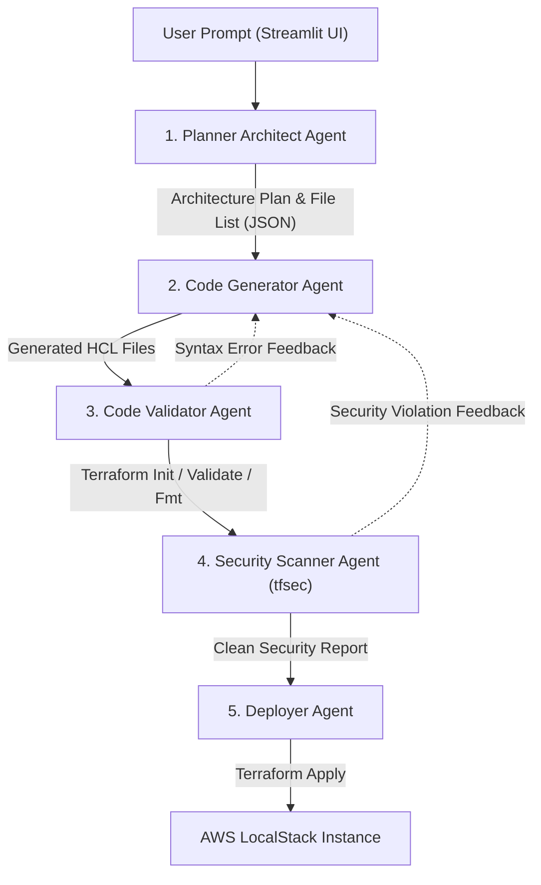

# AI-Powered Cloud Infrastructure Automation (LangGraph + Terraform)

[](https://www.python.org/)
[](https://github.com/langchain-ai/langgraph)
[](https://www.terraform.io/)
[](https://github.com/aquasecurity/tfsec)
[](https://www.localstack.cloud/)

An autonomous multi-agent platform that translates natural language prompts into production-ready, secure Terraform Infrastructure as Code (IaC) and deploys it automatically to an emulated AWS environment using LocalStack.

Built with **LangGraph** and **Google Gemini**, the system operates a five-stage sequential agent pipeline that plans architecture, writes modular HCL code, validates syntax, scans for security misconfigurations via `tfsec`, and performs auto-approved deployments.

---

## 🚀 Key Features

* **Natural Language to Cloud IaC**: Define infrastructure requirements in plain English (e.g., *"Set up an encrypted S3 bucket with versioning and an IAM role with read-only access"*).
* **Multi-Agent Sequential Pipeline**: Modular separation of concerns across Planning, Code Generation, Syntax Validation, Security Auditing, and Deployment.
* **Security-First with `tfsec`**: Embedded security scanner checks every generated HCL file against strict compliance rules (e.g., unencrypted storage, public bucket ACLs, open security groups) before deployment.
* **Local Emulation via LocalStack**: Zero AWS cloud bills and zero deployment risks. Test complete multi-tier infrastructure configurations locally.
* **Interactive Web Interface**: Visual workflow tracking and deployment monitoring powered by **Streamlit**.

---

## 🤖 Multi-Agent Workflow



### Agent Roles & Responsibilities

| Agent | Responsibilities |
| :--- | :--- |
| **1. Planner Architect** | Ingests the user request, references `TFSEC_RULES.md`, determines required resources, and produces a structured plan with file manifests (`provider.tf`, `main.tf`, `variables.tf`). |
| **2. Code Generator** | Iteratively generates clean HCL code file-by-file without markdown clutter, respecting LocalStack AWS provider constraints. |
| **3. Code Validator** | Saves code to disk, initializes Terraform (`terraform init`), runs `terraform validate`, and standardizes formatting (`terraform fmt`). |
| **4. Security Scanner** | Executes `tfsec` on generated configurations to detect vulnerabilities and misconfigurations before deployment. |
| **5. Deployer** | Executes `terraform apply -auto-approve` against the LocalStack endpoint and returns execution state. |

---

## 📁 Repository Structure

```
├── app.py                     # Streamlit frontend application
├── agents.py                  # LangGraph agent definitions & prompts
├── workflow.py                # Graph construction, state transitions, & execution
├── tools.py                   # Shell utilities (Terraform, tfsec, LocalStack)
├── utils.py                   # Helper functions & code parsers
├── requirements.txt           # Python dependencies
├── docker-compose.yml         # LocalStack container configuration
├── LLM_CONTEXT.md             # Developer system prompt & architectural context
├── TFSEC_RULES.md             # Curated security scanning rules & heuristics
└── project/                   # Base Terraform provider & configuration files
```

---

## 🛠️ Quick Start

### 1. Prerequisites
* Python 3.10+
* Docker & Docker Compose (for LocalStack)
* [Terraform CLI](https://developer.hashicorp.com/terraform/downloads) installed
* [tfsec](https://github.com/aquasecurity/tfsec) installed
* Google Gemini API Key

### 2. Setup LocalStack
```bash
docker compose up -d
```
Verify LocalStack health at `http://localhost:4566/_localstack/health`.

### 3. Installation
```bash
# Clone the repository
git clone https://github.com/souradeepdutta/Cloud-Infrastructure-Automation-using-GenAI.git
cd Cloud-Infrastructure-Automation-using-GenAI

# Create virtual environment
python3 -m venv .venv
source .venv/bin/activate

# Install dependencies
pip install -r requirements.txt
```

### 4. Configuration
Set your Gemini API key:
```bash
export GEMINI_API_KEY="your-api-key"
```

### 5. Run the Application
```bash
streamlit run app.py
```
Open your browser at `http://localhost:8501`.

---

## 📜 License
This project is licensed under the [MIT License](LICENSE).
